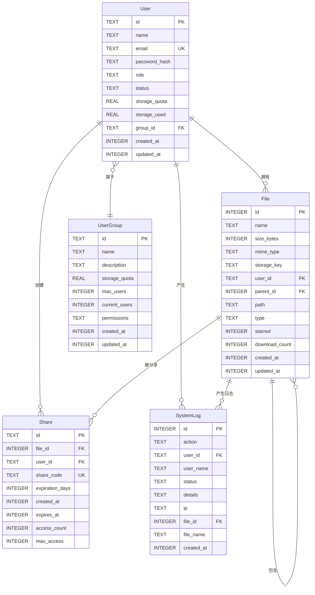

# SimpleShare 概念结构设计 - E-R图

## 1. 实体说明

### 1.1 用户实体 (User)

**实体描述**: 系统的使用者，包括普通用户和管理员

**属性**:
- **id** (主键): 用户唯一标识符
- **name**: 用户名
- **email**: 邮箱地址（唯一）
- **password_hash**: 密码哈希值
- **role**: 用户角色（admin/user）
- **status**: 账户状态（活跃/已暂停）
- **storage_quota**: 存储配额（GB）
- **storage_used**: 已用存储（GB）
- **group_id**: 所属用户组ID（外键）
- **created_at**: 创建时间
- **updated_at**: 更新时间

### 1.2 文件实体 (File)

**实体描述**: 用户上传的文件元数据信息

**属性**:
- **id** (主键): 文件唯一标识符
- **name**: 文件名
- **size_bytes**: 文件大小（字节）
- **mime_type**: MIME类型
- **storage_key**: R2存储键值
- **user_id**: 文件所有者（外键）
- **parent_id**: 父文件夹ID（外键，自引用）
- **path**: 文件路径
- **type**: 文件类型（folder/pdf/image/video/zip/code）
- **starred**: 是否收藏（0/1）
- **download_count**: 下载次数
- **created_at**: 创建时间
- **updated_at**: 更新时间

### 1.3 分享实体 (Share)

**实体描述**: 文件分享记录

**属性**:
- **id** (主键): 分享记录唯一标识符
- **file_id**: 被分享的文件ID（外键）
- **user_id**: 分享创建者ID（外键）
- **share_code**: 分享码（6位，唯一）
- **expiration_days**: 有效期天数
- **created_at**: 创建时间
- **expires_at**: 过期时间
- **access_count**: 访问次数
- **max_access**: 最大访问次数（可选）

### 1.4 用户组实体 (UserGroup)

**实体描述**: 用户组信息，用于批量管理用户权限和存储配额

**属性**:
- **id** (主键): 用户组唯一标识符
- **name**: 组名称
- **description**: 组描述
- **storage_quota**: 组存储配额（GB）
- **max_users**: 最大用户数
- **current_users**: 当前用户数
- **permissions**: 权限列表（JSON格式）
- **created_at**: 创建时间
- **updated_at**: 更新时间

### 1.5 系统日志实体 (SystemLog)

**实体描述**: 系统操作日志记录

**属性**:
- **id** (主键): 日志记录唯一标识符
- **action**: 操作类型
- **user_id**: 操作用户ID（外键，可为空）
- **user_name**: 操作用户名
- **status**: 操作状态（成功/警告/失败）
- **details**: 操作详情
- **ip**: IP地址
- **file_id**: 关联文件ID（外键，可为空）
- **file_name**: 关联文件名
- **created_at**: 创建时间

## 2. 实体间关系

### 2.1 用户-文件关系 (User-File)

**关系类型**: 一对多 (1:N)

**关系描述**: 一个用户可以拥有多个文件，一个文件只能属于一个用户

**关系属性**: 无

**基数**: 
- 用户端: 1（一个用户）
- 文件端: N（多个文件，N≥0）

**约束**: 
- 删除用户时，级联删除其所有文件（ON DELETE CASCADE）

### 2.2 文件-文件关系 (File-File)

**关系类型**: 一对多 (1:N) - 自引用关系

**关系描述**: 一个文件夹可以包含多个文件/文件夹，一个文件/文件夹只能属于一个父文件夹

**关系属性**: 无

**基数**:
- 父文件夹端: 1（一个父文件夹）
- 子文件端: N（多个子文件，N≥0）

**约束**:
- 删除文件夹时，级联删除其所有子文件（ON DELETE CASCADE）
- parent_id 可以为 NULL（表示根目录）

### 2.3 文件-分享关系 (File-Share)

**关系类型**: 一对多 (1:N)

**关系描述**: 一个文件可以生成多个分享记录，一个分享记录只能对应一个文件

**关系属性**: 无

**基数**:
- 文件端: 1（一个文件）
- 分享端: N（多个分享，N≥0）

**约束**:
- 删除文件时，级联删除其所有分享记录（ON DELETE CASCADE）

### 2.4 用户-分享关系 (User-Share)

**关系类型**: 一对多 (1:N)

**关系描述**: 一个用户可以创建多个分享，一个分享只能由一个用户创建

**关系属性**: 无

**基数**:
- 用户端: 1（一个用户）
- 分享端: N（多个分享，N≥0）

**约束**:
- 删除用户时，级联删除其所有分享记录（ON DELETE CASCADE）

### 2.5 用户-用户组关系 (User-UserGroup)

**关系类型**: 多对一 (N:1)

**关系描述**: 多个用户可以属于同一个用户组，一个用户只能属于一个用户组（可为空）

**关系属性**: 无

**基数**:
- 用户端: N（多个用户，N≥0）
- 用户组端: 1（一个用户组）

**约束**:
- 用户可以不属于任何用户组（group_id 可为 NULL）

### 2.6 用户-系统日志关系 (User-SystemLog)

**关系类型**: 一对多 (1:N)

**关系描述**: 一个用户可以产生多条系统日志，一条日志只能关联一个用户（可为空）

**关系属性**: 无

**基数**:
- 用户端: 1（一个用户，可为空）
- 日志端: N（多条日志，N≥0）

**约束**:
- 删除用户时，日志中的 user_id 置为 NULL（ON DELETE SET NULL）
- 系统操作可能没有关联用户（user_id 可为 NULL）

### 2.7 文件-系统日志关系 (File-SystemLog)

**关系类型**: 一对多 (1:N)

**关系描述**: 一个文件可以产生多条系统日志，一条日志只能关联一个文件（可为空）

**关系属性**: 无

**基数**:
- 文件端: 1（一个文件，可为空）
- 日志端: N（多条日志，N≥0）

**约束**:
- 删除文件时，日志中的 file_id 置为 NULL（ON DELETE SET NULL）
- 非文件操作可能没有关联文件（file_id 可为 NULL）

## 3. E-R图文字描述

```
                    ┌─────────────┐
                    │    User     │
                    │  (用户)     │
                    └──────┬──────┘
                           │
            ┌──────────────┼──────────────┐
            │              │              │
            │ 1            │ 1            │ 1
            │              │              │
            │ N            │ N            │ N
    ┌───────▼──────┐  ┌───▼────┐  ┌──────▼──────┐
    │    File      │  │ Share  │  │ SystemLog   │
    │   (文件)     │  │(分享)  │  │ (系统日志)  │
    └──────┬───────┘  └───┬────┘  └─────────────┘
           │              │              │
           │ 1            │              │
           │              │              │
           │ N            │              │
    ┌──────▼───────┐      │              │
    │    File      │      │              │
    │ (自引用关系) │      │              │
    │  (文件夹)    │      │              │
    └──────────────┘      │              │
                          │              │
                    ┌─────▼──────┐       │
                    │ UserGroup  │       │
                    │  (用户组)  │       │
                    └────────────┘       │
                                         │
                           ┌─────────────┘
                           │
                    (关系说明)
```

## 4. 完整E-R图说明

### 4.1 核心实体关系

1. **User ↔ File (1:N)**
   - 用户拥有文件
   - 级联删除

2. **File ↔ File (1:N) - 自引用**
   - 文件夹包含文件
   - 支持多级目录结构
   - 级联删除

3. **File ↔ Share (1:N)**
   - 文件可以被分享
   - 级联删除

4. **User ↔ Share (1:N)**
   - 用户创建分享
   - 级联删除

5. **User ↔ UserGroup (N:1)**
   - 用户属于用户组
   - 可选关系

6. **User ↔ SystemLog (1:N)**
   - 用户产生日志
   - 级联置空

7. **File ↔ SystemLog (1:N)**
   - 文件操作产生日志
   - 级联置空

### 4.2 关系完整性约束

- **参照完整性**: 所有外键都设置了适当的约束
- **级联删除**: 删除用户/文件时，自动删除相关记录
- **级联置空**: 删除用户/文件时，日志中的关联字段置为NULL
- **唯一性约束**: email、share_code 等字段设置唯一约束

### 4.3 设计特点

1. **存算分离**: File实体只存储元数据，实际文件存储在R2
2. **层级结构**: File实体支持自引用，实现文件夹树形结构
3. **审计追踪**: SystemLog实体记录所有关键操作
4. **权限管理**: UserGroup实体支持批量权限管理
5. **分享机制**: Share实体实现文件分享功能

## 5. E-R图绘制工具建议

可以使用以下工具绘制E-R图：

1. **在线工具**:
   - draw.io (https://app.diagrams.net/)
   - Lucidchart
   - Creately

2. **本地工具**:
   - Microsoft Visio
   - MySQL Workbench
   - DBeaver

3. **代码工具**:
   - PlantUML
   - Mermaid

### 5.1 Mermaid E-R图代码示例



## 6. 实体关系矩阵

| 实体 | User | File | Share | UserGroup | SystemLog |
|------|------|------|-------|-----------|-----------|
| **User** | - | 1:N (拥有) | 1:N (创建) | N:1 (属于) | 1:N (产生) |
| **File** | N:1 (属于) | 1:N (包含) | 1:N (被分享) | - | 1:N (产生日志) |
| **Share** | N:1 (创建者) | N:1 (被分享文件) | - | - | - |
| **UserGroup** | 1:N (包含) | - | - | - | - |
| **SystemLog** | N:1 (操作者) | N:1 (关联文件) | - | - | - |

## 7. 设计说明

本E-R图设计遵循以下原则：

1. **规范化**: 所有实体都满足第三范式（3NF），消除数据冗余
2. **完整性**: 通过外键约束保证数据完整性
3. **可扩展性**: 支持未来功能扩展（如用户组权限细化）
4. **性能优化**: 通过索引优化查询性能
5. **安全性**: 敏感信息（如密码）进行哈希处理

